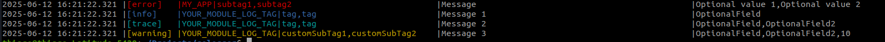
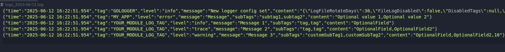

#### Gologger

A golang custom logger based on the loggrus logger:
https://github.com/sirupsen/logrus

Install it by using:

```
go get github.com/thiagohagy/gologger-v2
 
#if you encounter an error try:
GOPRIVATE=github.com/thiagohagy/gologger-v2 go get github.com/thiagohagy/gologger-v2
```
Created to make possible to have logs separated by type and module, where you can enable/disable using the tags and logs types

You will have two types of structure, the MainLogger and Logger

The MainLogger is used to configure how the logs will work, you can have more, but is usual to have only one MainLogger per app

#### Configuration options #### 
- DisabledTags
    The option will make the logger not print logs with the given tags
    This is usefull for reducing the amount of logs without changing you code
- LogFileRotateDays
    Log files older than this limit will be removed
- LogLevel
    This limiter makes all the log level lower than the one in the configuration to not be printed
    For example:
    "debug" will make logs from levels trace to not be printed (see the hierarchy bellow)
- FileLogDisabled 
    This disable the file logging, only the O.S log will work
- MessageOptions
    This is used to configure how the messages are displayed in the terminal 
    - DisableSpacing
        Disable spacing between log fields
    - ContentDelimiter
        Character used to separate log fields
    - TextFiller
        Character used to fill the prealocated space for message and tags if DisableSpacing is false 
    - MessagePrealocatedSize
        Minimum space reserved for the message
    - TagPrealocatedSize
        Minimum space reserved for the tag/subtags
    - DateFormat
        Date format
    - UseJsonOutput
        If you want to use the json output format, overwrite other options

#### Log Levels ####

The order that is used when limiting the logs is: (from more important to less important)
- Trace
- Debug
- Info
- Warn
- Error
- Fatal
- Panic

If you set the logLevel to Error, all less important levels(Warn, Info, Debug, Trace) will not be printed anywhere

#### MainLogger ####

The MainLogger is the structure that defines how the logs will work on you app

When initializing it you can pass some configurations (listed above), once you created it you can create Loggers with tags for better identification

You can use it to log without the need for a Logger

Example using custom message configurations:
On you main.go file:
~~~ go
// Creating the main logger
appLogger := gologger.NewMainLogger(&gologger.AppLoggerOptions{
    LogFileRotateDays: 30,
    FileLogDisabled:   false,
    LogLevel:          "trace", //can be trace, debug, info, waning , fatal, panic
    MessageOptions: &gologger.MessageOptions{
        DisableSpacing:         false,
        ContentDelimiter:       "|",
        TextFiller:             "",
        MessagePrealocatedSize: 30,
        TagPrealocatedSize:     30,
        UseJsonOutput:          false,
    },
})

appLogger.Log(
    gologger.ErrorLevel, "MY_APP", []string{"subtag1", "subtag2"}, "Message", "Optional value 1", "Optional value 2",
)
~~~

This package will log to your terminal and to a file(one file per day if FileLogDisabled is false) under a /logs folder in your project root folder

You can configure the log rotate if needed (30 days by default)

To update the MainLogger config on the fly, you can use:
~~~go
// Setting a custom config
appLogger.SetConfig(
    gologger.AppLoggerOptions{
        DisabledTags:      arrayOfDisabledTags,
        LogFileRotateDays: 10,
        LogLevel:          "info", //can be trace, debug, info, waning , fatal, panic
        ...
    },
)
~~~

#### Creating Loggers for your app:
To use it as intended, you should create multiple Loggers, each one with a unique Tag

To create new Loggers you only need to pass the appLogger created and a unique Tag

For the subTags you can use a variable , nil or define its value each time

~~~go
// creating a logger
logger := gologger.NewLogger("YOUR_MODULE_LOG_TAG", appLogger)

// using the logger
subTags := []string{"tag", "tag"}

logger.Info("Message 1", subTags, "OptionalField")

logger.Trace("Message 2", subTags, "OptionalField", "OptionalField2")

logger.Warn("Message 3", []string{"customSubTag1","customSubTag2"}, "OptionalField", "OptionalField2", "10")

~~~


Log function definition:
~~~go
func (l *Logger) Trace(message string, subTags []string, content ...string) {...}
~~~

Log functions params:
- Message: Message you want to print
- SubTags (optional): Helps identifying you logs
- A indefinite number of string values, they will be printed as "content" in the log 

The above code will output this logs in the terminal:



The logs are also written to the day file in the json format(Always in json for the file):
